# WPInfo Telegram Bot - Technical Documentation

**Project:** WPInfo Telegram Bot  
**Version:** 2.0  
**Last Updated:** February 16, 2026  
**Author:** farahaniamin  
**Repository:** https://github.com/farahaniamin/WpDetectionBot

---

## 1. Overview

### 1.1 What It Is

WPInfo Telegram Bot is a comprehensive WordPress security and analysis tool delivered through Telegram. It analyzes WordPress sites to detect themes, plugins, versions, security vulnerabilities, and SEO issues. The bot provides real-time monitoring, automated notifications for new vulnerabilities, and detailed reports in Persian (Farsi) language.

### 1.2 Who It's For

- **WordPress Site Owners** - Monitor their sites for security issues and updates
- **Web Developers** - Quick analysis of client sites before/after deployment
- **Security Researchers** - Track vulnerabilities across multiple sites
- **SEO Specialists** - Audit sites for SEO issues and improvements
- **Digital Agencies** - Monitor multiple client sites from one interface

### 1.3 How It Creates Value

- **Security Monitoring** - Automated vulnerability detection via Wordfence integration
- **Site Analysis** - Comprehensive WordPress stack detection (themes, plugins, versions)
- **Proactive Alerts** - Real-time notifications for Critical/High severity vulnerabilities
- **SEO Auditing** - Full SEO analysis with 5-pillar scoring system
- **Multi-site Management** - Watch and monitor multiple sites from Telegram
- **Bilingual Support** - Full Persian (Farsi) interface with RTL support

---

## 2. Goals & Non-Goals

### 2.1 Goals

- ✅ Analyze WordPress sites for themes, plugins, and versions
- ✅ Monitor sites for security vulnerabilities automatically
- ✅ Integrate with Wordfence vulnerability database
- ✅ Provide real-time vulnerability notifications
- ✅ Support SEO auditing via external Seo-Audit-API
- ✅ Offer intuitive Persian-language Telegram interface
- ✅ Store analysis history and user preferences
- ✅ Handle high concurrent load with rate limiting
- ✅ Ensure data privacy (no sensitive data stored)

### 2.2 Non-Goals

- ❌ WordPress plugin/theme installation or updates
- ❌ Site backup or migration services
- ❌ Real-time traffic monitoring
- ❌ Competitor analysis
- ❌ Mobile app (Telegram-only interface)
- ❌ JavaScript-rendered SPA analysis (basic HTML only)

---

## 3. Users & Key Use-Cases

### 3.1 Primary Users

| User Type            | Use Case                          | Success Criteria                       |
| -------------------- | --------------------------------- | -------------------------------------- |
| **WordPress Owner**  | Check site security status        | Complete analysis in < 30 seconds      |
| **Developer**        | Analyze client site before launch | Accurate theme/plugin detection        |
| **Agency Manager**   | Monitor 20+ client sites          | Weekly vulnerability reports           |
| **Security Analyst** | Track CVEs across watched sites   | Real-time Critical alerts              |
| **SEO Specialist**   | Audit site SEO health             | 5-pillar scoring with actionable fixes |

### 3.2 Key User Journeys

**Journey 1: First-Time Security Check**

1. User clicks "🔍 بررسی سایت" (Analyze Site)
2. Bot prompts for URL with visual capabilities list
3. User sends URL
4. Progress indicator shows real-time analysis stages
5. Detailed report delivered with theme, plugins, vulnerabilities
6. Option to add to monitoring (Watch)

**Journey 2: Vulnerability Monitoring Setup**

1. User clicks "👁️ مانیتورینگ" (Monitoring)
2. User sends site URL
3. Bot analyzes site to verify it's WordPress
4. Site added to watch list with success confirmation
5. User receives automatic alerts for new vulnerabilities

**Journey 3: SEO Audit**

1. User clicks "📊 SEO Audit" menu
2. Bot prompts for URL with SEO capabilities
3. User sends URL
4. Progress updates every 2 seconds (queued → crawl → analysis → scoring)
5. 5-pillar SEO report with grade (A-F) delivered
6. PDF download link provided (if external API accessible)

**Journey 4: Managing Watched Sites**

1. User clicks "📁 سایت‌های من" (My Sites)
2. List of monitored sites shown as interactive buttons
3. User clicks a site to see details (theme, plugins, status)
4. Options to delete or stop monitoring
5. Confirmation with appropriate feedback

---

## 4. Tech Stack

| Layer                  | Technology     | Purpose                | Why Chosen                                           | Alternatives                    |
| ---------------------- | -------------- | ---------------------- | ---------------------------------------------------- | ------------------------------- |
| **Runtime**            | Node.js 20+    | JavaScript execution   | ESM support, async/await, native fetch               | Deno, Bun                       |
| **Language**           | TypeScript 5.x | Type safety            | Strict typing, better DX, catches errors early       | JavaScript                      |
| **Bot Framework**      | Grammy 1.x     | Telegram Bot API       | Modern, TypeScript-first, middleware support         | Telegraf, node-telegram-bot-api |
| **Database**           | SQLite 3       | Data storage           | Zero-config, single file, WAL mode, sufficient scale | PostgreSQL, MySQL               |
| **HTTP Client**        | Native fetch   | External API calls     | No dependencies, modern standard                     | Axios, node-fetch               |
| **Validation**         | Zod            | Schema validation      | TypeScript-first, runtime validation                 | Joi, Yup                        |
| **Queue**              | P-Queue        | Concurrent operations  | Lightweight, promise-based                           | Bull, Bee Queue                 |
| **Build Tool**         | TSX            | Development hot reload | Fast, TypeScript native, watch mode                  | ts-node, nodemon                |
| **Process Management** | Concurrently   | Dev script running     | Simple parallel processes                            | Docker Compose                  |

### 4.1 Runtime Versions

- **Node.js:** >= 20.0.0 (required for native fetch, structuredClone)
- **TypeScript:** 5.x
- **Package Manager:** npm 10+

### 4.2 External Integrations

| Service              | Purpose                | Integration Type                         |
| -------------------- | ---------------------- | ---------------------------------------- |
| **Telegram Bot API** | User interface         | Long polling via Grammy                  |
| **Wordfence API**    | Vulnerability database | REST API with API key                    |
| **Seo-Audit-API**    | SEO analysis           | REST API (optional, local or remote)     |
| **Target Websites**  | WordPress analysis     | HTTP scraping with respect to robots.txt |

---

## 5. Architecture

### 5.1 High-Level Description

Single-process monolithic architecture with SQLite database. The bot runs as a single Node.js process handling Telegram updates via long polling. SQLite operates in WAL (Write-Ahead Logging) mode for concurrent read/write operations. Background jobs (vulnerability sync, watch checks) run within the same process using setInterval.

### 5.2 Component Breakdown

**Bot Core (`src/index.ts`)**

- Initializes Telegram bot with Grammy
- Sets up session middleware
- Registers all handlers
- Starts long polling
- Schedules background jobs

**Handlers (`src/bot/handlers/`)**

- `menu.ts` - Main menu, site analysis, watch management, SEO audit flow
- `analyze.ts` - Site analysis runner with progress tracking
- `settings.ts` - User notification preferences
- `recent.ts` - Recent vulnerabilities list
- `sync.ts` - Admin-only sync commands

**Services (`src/services/`)**

- `siteAnalyzer.ts` - Core WordPress analysis engine
- `seoAuditApi.ts` - HTTP client for Seo-Audit-API
- `wordfenceFeed.ts` - Wordfence vulnerability sync
- `watchService.ts` - Watch notification system
- `urlGuard.ts` - URL validation and normalization
- `fetcher.ts` - HTTP request wrapper with caching

**Database (`src/db/`)**

- `db.ts` - SQLite connection and schema
- `repos.ts` - Repository pattern for all DB operations

**UI Layer (`src/ui/`)**

- `keyboards.ts` - Inline keyboard definitions
- `formatters/` - Message formatting (reports, SEO, progress)
- `progress.ts` - Progress indicator for long operations

**Middleware (`src/bot/middlewares/`)**

- `rateLimit.ts` - Per-user rate limiting
- `adminOnly.ts` - Admin command protection

### 5.3 Data Flow


### 5.4 Architecture Diagram


### 5.5 Sequence Diagram: Site Analysis

```mermaid
sequenceDiagram
    participant U as User
    participant B as Bot
    participant R as RateLimiter
    participant H as MenuHandler
    participant S as SiteAnalyzer
    participant F as Fetcher
    participant D as Database
    participant W as Target Website

    U->>B: Click "🔍 بررسی سایت"
    B->>H: callbackQuery(menu:analyze)
    H->>H: Set flow='awaiting_analyze_url'
    H->>B: Show URL prompt
    B->>U: "آدرس سایت رو بفرست..."

    U->>B: Send URL: https://example.com
    B->>R: Check rate limit
    R-->>B: Allowed

    B->>H: message:text
    H->>H: Validate URL format
    H->>S: createAnalyzeRunner
    S->>D: Check cache

    alt Cache miss
        S->>F: Fetch homepage
        F->>W: GET / (with user-agent)
        W-->>F: HTML response
        F-->>S: HTML content

        S->>S: Detect WordPress
        S->>S: Extract theme
        S->>S: Extract plugins
        S->>S: Check vulnerabilities
        S->>D: Store in cache
    end

    S->>D: insertEvent(analysis)
    S-->>H: AnalysisResult
    H->>H: formatAnalysisReport
    H->>B: Send formatted report
    B->>U: 📊 Report with inline keyboard
```



### 5.6 Key Design Decisions

| Decision                            | Rationale                                          | Tradeoff                     |
| ----------------------------------- | -------------------------------------------------- | ---------------------------- |
| **SQLite over PostgreSQL**          | Zero-config, single file, sufficient for bot scale | Not horizontally scalable    |
| **Single process vs microservices** | Simpler deployment, no IPC complexity              | Limited vertical scaling     |
| **Long polling vs webhooks**        | Works behind NAT/firewall, simpler setup           | Higher latency than webhooks |
| **In-memory cache**                 | Speed, no external dependency                      | Cache lost on restart        |
| **WAL mode SQLite**                 | Concurrent reads while writing                     | Slightly higher disk usage   |

---

## 6. Repository Structure

```
wpinfo-telegram-bot/
├── src/
│   ├── index.ts                    # Entry point, bot initialization
│   ├── bot/
│   │   ├── context.ts              # Session types, MyContext definition
│   │   ├── handlers/
│   │   │   ├── menu.ts             # Main menu, site analysis, watch mgmt, SEO
│   │   │   ├── analyze.ts          # Analysis runner with queue
│   │   │   ├── settings.ts         # User notification preferences
│   │   │   ├── recent.ts           # Recent vulnerabilities
│   │   │   ├── stats.ts            # User statistics
│   │   │   └── sync.ts             # Admin sync commands
│   │   └── middlewares/
│   │       ├── rateLimit.ts        # Per-user rate limiting
│   │       └── adminOnly.ts        # Admin authorization
│   ├── core/
│   │   ├── config.ts               # Environment configuration (Zod)
│   │   └── types.ts                # Shared TypeScript types
│   ├── db/
│   │   ├── db.ts                   # SQLite connection, schema
│   │   └── repos.ts                # Repository pattern, all DB operations
│   ├── services/
│   │   ├── analyzers/              # WordPress detection modules
│   │   │   ├── wordpressDetector.ts
│   │   │   ├── themeDetector.ts
│   │   │   ├── pluginDetector.ts
│   │   │   ├── versionHints.ts
│   │   │   └── hostingHints.ts
│   │   ├── security/               # Security-related services
│   │   │   ├── wordfenceFeed.ts    # Vulnerability sync
│   │   │   ├── watchService.ts     # Watch notifications
│   │   │   └── securityHints.ts    # Security headers check
│   │   ├── siteAnalyzer.ts         # Main analysis orchestrator
│   │   ├── seoAuditApi.ts          # Seo-Audit-API client
│   │   ├── urlGuard.ts             # URL validation/normalization
│   │   └── fetcher.ts              # HTTP client with caching
│   ├── ui/
│   │   ├── keyboards.ts            # Inline keyboard definitions
│   │   ├── progress.ts             # Progress indicators
│   │   └── formatters/             # Message formatters
│   │       ├── reportFormatter.ts  # Site analysis reports
│   │       └── seoReportFormatter.ts # SEO audit reports
│   └── types.d.ts                  # Global type declarations
├── data/                           # SQLite database (gitignored)
├── dist/                           # Compiled JavaScript (build output)
├── .env.example                    # Environment template
├── .gitignore
├── package.json
├── tsconfig.json
└── README.md
```

### 6.1 Where to Change X

| If you need to...       | Go to...                               |
| ----------------------- | -------------------------------------- |
| Add new bot command     | `src/bot/handlers/menu.ts`             |
| Change menu layout      | `src/ui/keyboards.ts`                  |
| Modify analysis logic   | `src/services/siteAnalyzer.ts`         |
| Add new DB table        | `src/db/db.ts` (initDb function)       |
| Change report format    | `src/ui/formatters/reportFormatter.ts` |
| Add new config variable | `src/core/config.ts`                   |
| Modify rate limits      | `src/bot/middlewares/rateLimit.ts`     |
| Add WordPress detection | `src/services/analyzers/`              |

---

## 7. Data Model

### 7.1 Entities

#### Table: `users`

Stores user preferences and settings.

| Column         | Type    | Constraints | Description                  |
| -------------- | ------- | ----------- | ---------------------------- |
| id             | INTEGER | PRIMARY KEY | Telegram user ID             |
| notify_vulns   | BOOLEAN | DEFAULT 1   | Alert on new vulnerabilities |
| notify_updates | BOOLEAN | DEFAULT 1   | Alert on plugin updates      |
| created_at     | INTEGER | NOT NULL    | Unix timestamp               |

#### Table: `watches`

Sites being monitored by users.

| Column           | Type    | Constraints               | Description                |
| ---------------- | ------- | ------------------------- | -------------------------- |
| id               | INTEGER | PRIMARY KEY AUTOINCREMENT | Internal ID                |
| user_id          | INTEGER | NOT NULL, FK → users.id   | Owner                      |
| origin           | TEXT    | NOT NULL                  | Normalized origin (domain) |
| url              | TEXT    | NOT NULL                  | Full normalized URL        |
| components_json  | TEXT    |                           | Theme/plugins JSON         |
| created_at       | INTEGER | NOT NULL                  | Unix timestamp             |
| last_notified_at | INTEGER |                           | Last alert timestamp       |

#### Table: `cache`

Analysis results cache.

| Column      | Type    | Constraints | Description          |
| ----------- | ------- | ----------- | -------------------- |
| origin      | TEXT    | PRIMARY KEY | Site origin          |
| result_json | TEXT    | NOT NULL    | Analysis result JSON |
| created_at  | INTEGER | NOT NULL    | Unix timestamp       |
| expires_at  | INTEGER | NOT NULL    | Expiration timestamp |

#### Table: `vulnerabilities`

Vulnerability database from Wordfence.

| Column         | Type | Constraints | Description                         |
| -------------- | ---- | ----------- | ----------------------------------- |
| id             | TEXT | PRIMARY KEY | Wordfence vuln ID                   |
| title          | TEXT | NOT NULL    | Vulnerability title                 |
| software_slug  | TEXT |             | Affected plugin/theme slug          |
| software_type  | TEXT |             | 'plugin' or 'theme'                 |
| severity       | TEXT |             | 'Critical', 'High', 'Medium', 'Low' |
| cvss_score     | REAL |             | CVSS score                          |
| published_date | TEXT |             | ISO 8601 date                       |
| json           | TEXT | NOT NULL    | Full vuln data JSON                 |

#### Table: `events`

Audit trail for analytics.

| Column      | Type    | Constraints               | Description             |
| ----------- | ------- | ------------------------- | ----------------------- |
| id          | INTEGER | PRIMARY KEY AUTOINCREMENT | Internal ID             |
| ts          | INTEGER | NOT NULL                  | Unix timestamp          |
| user_id     | INTEGER | NOT NULL                  | Telegram user ID        |
| chat_id     | INTEGER | NOT NULL                  | Telegram chat ID        |
| command     | TEXT    | NOT NULL                  | Command name            |
| origin      | TEXT    |                           | Target site origin      |
| duration_ms | INTEGER |                           | Operation duration      |
| result      | TEXT    |                           | 'ok', 'error', 'cached' |
| error_code  | TEXT    |                           | Error code if failed    |

### 7.2 Relationships

```
users (1) -----> (0..N) watches
users (1) -----> (0..N) events
vulnerabilities (1) -----> (0..N) watch notifications (via matching)
```

### 7.3 Indexes

```sql
CREATE INDEX idx_watches_user ON watches(user_id);
CREATE INDEX idx_watches_origin ON watches(origin);
CREATE INDEX idx_cache_expires ON cache(expires_at);
CREATE INDEX idx_vulns_severity ON vulnerabilities(severity);
CREATE INDEX idx_vulns_software ON vulnerabilities(software_slug);
CREATE INDEX idx_events_user ON events(user_id, ts);
```

### 7.4 Data Lifecycle

**Cache TTL:** 10 minutes (configurable via `CACHE_TTL_SEC`)  
**Vulnerability Retention:** Permanent (Wordfence feed append-only)  
**Event Retention:** No automatic cleanup (manual purge if needed)  
**Watch Expiration:** None (persistent until user deletes)

---

## 8. API Contract

### 8.1 Authentication

**Method:** Telegram Bot Token via Grammy framework  
**User Identification:** Telegram user_id  
**Admin Access:** Configured via `ADMIN_USER_IDS` env variable

### 8.2 Rate Limiting

- **Per User:** 10 requests per 60 seconds (configurable)
- **Penalty:** 30 second block if exceeded (configurable)
- **Cache:** Responses cached per URL for 10 minutes

### 8.3 Error Format

```json
{
  "error": {
    "code": "ERROR_CODE",
    "message": "Human readable Persian description"
  }
}
```

**Common Error Codes:**

- `BAD_REQUEST` - Invalid input
- `RATE_LIMITED` - Too many requests
- `INVALID_URL` - Malformed URL
- `SITE_UNREACHABLE` - HTTP connection failed
- `NOT_WORDPRESS` - Site doesn't appear to be WordPress

### 8.4 Commands

Telegram bot commands are text-based, not HTTP endpoints. Key commands:

#### /start

**Description:** Initialize bot, show main menu  
**Response:** Welcome message with inline keyboard

#### /analyze <url>

**Description:** Analyze a WordPress site  
**Parameters:**
| Name | Type | Required | Description |
|------|------|----------|-------------|
| url | string | Yes | Site URL to analyze |

**Example:** `/analyze https://example.com`

**Success Response:**
Detailed HTML-formatted report with:

- WordPress version (if detectable)
- Theme name and version
- List of detected plugins
- Security headers status
- Known vulnerabilities (if any)

#### /seo <url>

**Description:** Run SEO audit via Seo-Audit-API  
**Parameters:**
| Name | Type | Required | Description |
|------|------|----------|-------------|
| url | string | Yes | Site URL to audit |

**Example:** `/seo https://example.com`

**Success Response:**
5-pillar SEO report with grade (A-F) and PDF download link.

#### /watch <url>

**Description:** Add site to vulnerability monitoring  
**Parameters:**
| Name | Type | Required | Description |
|------|------|----------|-------------|
| url | string | Yes | Site URL to monitor |

**Example:** `/watch https://example.com`

**Success Response:**

```
✅ مانیتور فعال شد برای example.com
```

#### /unwatch <url>

**Description:** Remove site from monitoring  
**Parameters:**
| Name | Type | Required | Description |
|------|------|----------|-------------|
| url | string | Yes | Site URL to unwatch |

**Example:** `/unwatch https://example.com`

#### /mywatches

**Description:** List all monitored sites  
**Response:** Interactive list with site details and management buttons

#### /recent [days]

**Description:** Show recent vulnerabilities  
**Parameters:**
| Name | Type | Required | Description | Default |
|------|------|----------|-------------|---------|
| days | number | No | Number of days back | 30 |

**Example:** `/recent 7`

#### /settings

**Description:** Show notification settings  
**Response:** Interactive settings with toggle buttons

#### /sync_status (Admin only)

**Description:** Check Wordfence sync status  
**Authorization:** User ID must be in `ADMIN_USER_IDS`

#### /sync_vulns (Admin only)

**Description:** Trigger manual vulnerability sync  
**Authorization:** Admin only

---

## 9. Security & Privacy

### 9.1 Threats & Mitigations

| Threat                   | Mitigation                             | Status         |
| ------------------------ | -------------------------------------- | -------------- |
| **Private IP scanning**  | Block localhost, 192.168.x.x, 10.x.x.x | ✅ Implemented |
| **robots.txt bypass**    | Check and respect robots.txt           | ✅ Implemented |
| **Rate limiting bypass** | Per-user rate limiting with penalty    | ✅ Implemented |
| **SQL Injection**        | Parameterized queries (better-sqlite3) | ✅ Protected   |
| **XSS**                  | HTML escaping via esc() function       | ✅ Implemented |
| **Token exposure**       | .env file, never logged                | ✅ Protected   |
| **Data retention**       | No PII stored, cache auto-expires      | ✅ Implemented |

### 9.2 Secrets Handling

**Environment Variables (.env):**

```bash
BOT_TOKEN=your_telegram_bot_token_here
WORDFENCE_API_KEY=your_wordfence_api_key
SEO_AUDIT_API_URL=http://localhost:8787  # or remote URL
ADMIN_USER_IDS=12345678,87654321  # Telegram user IDs
```

**Security Rules:**

- `.env` file in `.gitignore` - never committed
- Bot token logged only on startup (masked)
- No sensitive data in error messages

### 9.3 Data Protection

- **No PII Stored:** Only Telegram user_id (already public)
- **No Site Credentials:** Only analyzes public-facing sites
- **Cache Encryption:** Not required (public data only)
- **GDPR Compliance:** No personal data retention issues

---

## 10. Performance & Scalability

### 10.1 Expected Load

- **Concurrent Users:** ~100 (Telegram rate limits apply)
- **Analyses per Hour:** ~500 (with caching)
- **Watch Notifications:** Every 6 hours (configurable)
- **Vulnerability Sync:** Every 6 hours (configurable)

### 10.2 Caching Strategy

**Analysis Cache:**

- TTL: 10 minutes (`CACHE_TTL_SEC`)
- Key: Site origin (domain)
- Storage: SQLite `cache` table

**Vulnerability Cache:**

- TTL: 6 hours (`WORDFENCE_SYNC_INTERVAL_MIN`)
- Source: Wordfence API
- Storage: SQLite `vulnerabilities` table

### 10.3 Background Jobs

```typescript
// Wordfence vulnerability sync
setInterval(runWordfenceSync, 6 * 60 * 60 * 1000);

// Watch notifications
setInterval(runWatchNotifications, 6 * 60 * 60 * 1000);

// Cache cleanup
setInterval(pruneExpiredCache, 10 * 60 * 1000);
```

### 10.4 Concurrency

**Analysis Queue:** P-Queue with concurrency 4 (`CONCURRENCY`)
**Rate Limiting:** Per-user sliding window
**Database:** WAL mode allows concurrent reads during writes

### 10.5 Bottlenecks & Mitigation

| Bottleneck               | Impact             | Mitigation                     |
| ------------------------ | ------------------ | ------------------------------ |
| **Slow target sites**    | Long analysis time | 8-second timeout per request   |
| **SQLite single file**   | Write contention   | WAL mode, read-heavy workload  |
| **Telegram rate limits** | Message throttling | 700ms minimum between edits    |
| **Large plugin lists**   | Message too long   | Limit to 30 plugins per report |

---

## 11. Observability

### 11.1 Logging

- **Console Output:** Structured logs to stdout
- **Log Levels:** info, warn, error
- **Key Events:**
  - Analysis start/complete
  - Vulnerability sync status
  - Watch notifications sent
  - Errors with stack traces

### 11.2 Metrics

Tracked in `events` table:

- Command usage frequency
- Analysis duration
- Cache hit/miss rates
- Error rates by type

### 11.3 Health Checks

**Manual:** `/health` endpoint (if HTTP server enabled)  
**Bot Status:** Check if process is running and responding to Telegram

### 11.4 Alerts (TBD)

- (ASSUMPTION) Could integrate with monitoring tools
- Watch for: High error rates, sync failures, disk space

---

## 12. Configuration

### 12.1 Environment Variables

| Name                          | Required | Default                    | Description                        |
| ----------------------------- | -------- | -------------------------- | ---------------------------------- |
| `BOT_TOKEN`                   | Yes      | -                          | Telegram bot token from @BotFather |
| `API_URL`                     | No       | `https://api.telegram.org` | Custom Telegram API URL            |
| `PROXY_URL`                   | No       | -                          | HTTP proxy for Telegram API        |
| `CONCURRENCY`                 | No       | `4`                        | Max concurrent analyses            |
| `REQUEST_TIMEOUT_MS`          | No       | `8000`                     | HTTP request timeout               |
| `USER_AGENT`                  | No       | `WpInfoBot/0.4`            | User-agent string                  |
| `RATE_LIMIT_WINDOW_SEC`       | No       | `60`                       | Rate limit window                  |
| `RATE_LIMIT_MAX`              | No       | `10`                       | Max requests per window            |
| `DB_PATH`                     | No       | `./data/wpinfo.db`         | SQLite database path               |
| `CACHE_TTL_SEC`               | No       | `600`                      | Cache TTL in seconds               |
| `WORDFENCE_API_KEY`           | No       | -                          | Wordfence API key                  |
| `WORDFENCE_SYNC_INTERVAL_MIN` | No       | `360`                      | Vuln sync interval                 |
| `WATCH_CHECK_INTERVAL_MIN`    | No       | `360`                      | Watch check interval               |
| `ADMIN_USER_IDS`              | No       | -                          | Comma-separated admin IDs          |
| `SEO_AUDIT_API_URL`           | No       | `http://localhost:8787`    | Seo-Audit-API endpoint             |
| `SEO_AUDIT_TIMEOUT_MS`        | No       | `300000`                   | SEO audit timeout (5 min)          |

### 12.2 Feature Flags

None currently implemented (TBD).

---

## 13. Local Development

### 13.1 Prerequisites

- Node.js >= 20.0.0
- npm >= 10.0.0
- Git

### 13.2 Setup

```bash
# Clone repository
git clone https://github.com/farahaniamin/WpDetectionBot.git
cd WpDetectionBot

# Install dependencies
npm install

# Setup environment
cp .env.example .env
# Edit .env and add your BOT_TOKEN

# Create data directory
mkdir -p data

# Build
npm run build
```

### 13.3 Run Commands

```bash
# Development (with hot reload)
npm run dev

# Production
npm run build
npm start

# Lint
npm run lint
```

### 13.4 Test Data

```bash
# Create test watch
curl -X POST "https://api.telegram.org/bot<TOKEN>/sendMessage" \
  -d "chat_id=<YOUR_ID>" \
  -d "text=/watch https://example.com"
```

### 13.5 Common Pitfalls

1. **Missing data directory:** Create `mkdir -p data`
2. **Invalid BOT_TOKEN:** Get from @BotFather
3. **SQLite permissions:** Ensure write access to `data/` folder
4. **Port conflicts:** Bot uses no ports (long polling)

---

## 14. Testing

### 14.1 Test Types

**(TBD)** No automated tests currently implemented.

**Recommended:**

- Unit tests: Jest/Vitest
- Integration tests: Test Telegram API mocking
- E2E tests: Manual testing with real Telegram

### 14.2 Manual Testing Checklist

- [ ] /start command shows menu
- [ ] Site analysis works for WordPress sites
- [ ] Non-WordPress sites handled gracefully
- [ ] Watch system adds/removes sites
- [ ] Vulnerability notifications sent
- [ ] Settings toggles work
- [ ] Rate limiting blocks excessive requests
- [ ] Admin commands restricted

### 14.3 CI Notes

**(TBD)** Could add GitHub Actions for:

- TypeScript type checking
- Linting
- Build verification

---

## 15. Deployment

### 15.1 Environments

- **Development:** Local machine with `npm run dev`
- **Production:** VPS/Cloud with `npm start`

### 15.2 Build/Release

```bash
# Build
npm run build

# Output in dist/ directory
# Deploy: dist/ + package.json + .env + data/
```

### 15.3 Deployment Options

**Option 1: PM2 (Recommended)**

```bash
npm install -g pm2
pm2 start dist/index.js --name wpinfo-bot
pm2 save
pm2 startup
```

**Option 2: Docker (TBD)**

```dockerfile
FROM node:20-alpine
WORKDIR /app
COPY package*.json ./
RUN npm ci --only=production
COPY dist/ ./dist/
COPY .env .
CMD ["node", "dist/index.js"]
```

**Option 3: Systemd**
Create service file (TBD).

### 15.4 Rollback Strategy

- Keep previous release
- Database migrations are additive only
- Restart with PM2: `pm2 restart wpinfo-bot`

### 15.5 Database Migrations

SQLite schema auto-created on startup. For changes:

1. Add new columns as nullable
2. Run data migration in code
3. Make required in next release

---

## 16. Troubleshooting / FAQ

### Q: Bot not responding to messages

**A:**

1. Check bot is running: `pm2 status`
2. Check logs: `pm2 logs wpinfo-bot`
3. Verify BOT_TOKEN is correct
4. Ensure no other instance is running (Telegram allows only one active session)

### Q: "Rate limit exceeded" error

**A:** Wait 60 seconds or adjust `RATE_LIMIT_*` env variables

### Q: Analysis returns "Site unreachable"

**A:**

- Check internet connectivity
- Verify URL includes http:// or https://
- Check if site blocks bots (robots.txt)

### Q: Vulnerability sync not working

**A:**

- Check `WORDFENCE_API_KEY` is set
- Check logs for sync errors
- Verify API key is valid at wordfence.com

### Q: SEO Audit shows no PDF button

**A:** This is expected for localhost SEO service. Telegram blocks localhost URLs in buttons.

---

## 17. Roadmap

### 17.1 Planned Improvements

- [ ] Batch site analysis (multiple URLs at once)
- [ ] Historical analysis comparison
- [ ] Export reports as JSON/CSV
- [ ] Scheduled automated audits
- [ ] Multi-language support (English)
- [ ] Webhook mode (alternative to long polling)
- [ ] Admin dashboard (web interface)

### 17.2 Known Limitations

- Single SQLite file (vertical scaling only)
- No JavaScript execution (SPA sites not fully supported)
- Telegram message length limits (4096 chars)
- No real-time traffic monitoring

---

## 18. Glossary

| Term            | Definition                                           |
| --------------- | ---------------------------------------------------- |
| **Origin**      | Domain name without protocol (e.g., example.com)     |
| **Watch**       | Monitored site for vulnerability alerts              |
| **Component**   | WordPress theme or plugin                            |
| **CVE**         | Common Vulnerabilities and Exposures identifier      |
| **Cache**       | Temporary storage of analysis results                |
| **Flow**        | User conversation state (awaiting_input, idle, etc.) |
| **WAL Mode**    | Write-Ahead Logging for SQLite concurrency           |
| **Smart Audit** | 50-page sample-based SEO audit                       |
| **Full Audit**  | 120-page comprehensive SEO audit                     |

---

## 19. Decision Log (Mini ADR)

### ADR-001: SQLite over PostgreSQL

**Decision:** Use SQLite for MVP  
**Context:** Need zero-config, single-file deployment  
**Consequences:**

- (+) No external dependencies
- (+) Easy backup (single file)
- (-) No horizontal scaling
- (-) Limited concurrent writes
  **Status:** Accepted for v1-v2

### ADR-002: Long Polling vs Webhooks

**Decision:** Use long polling  
**Context:** Works behind NAT/firewall, simpler setup  
**Consequences:**

- (+) No public URL required
- (+) Easier local development
- (-) Higher latency than webhooks
- (-) More bandwidth usage
  **Status:** Accepted

### ADR-003: External SEO Service

**Decision:** Integrate Seo-Audit-API instead of embedding  
**Context:** SEO auditing is complex, keep concerns separate  
**Consequences:**

- (+) Smaller bot codebase
- (+) Specialized SEO service can evolve independently
- (-) Additional service to deploy/monitor
- (-) Network dependency
  **Status:** Accepted

### ADR-004: Persian Language First

**Decision:** Primary language is Persian (Farsi)  
**Context:** Target users are Persian-speaking WordPress community  
**Consequences:**

- (+) Better UX for target audience
- (+) RTL text support
- (-) Limits international adoption
- (-) Translation needed for English users
  **Status:** Accepted (English support planned for v3)

---

## 20. Missing Info / Questions

### Essential Questions for Production

1. **Backup Strategy:** How to backup SQLite database? (ASSUMPTION: File copy sufficient)
2. **Monitoring:** What alerts needed for production issues? (ASSUMPTION: Manual log monitoring)
3. **Scaling:** Expected user count? (ASSUMPTION: < 1000 active users)
4. **Compliance:** Any specific data regulations? (ASSUMPTION: GDPR compliance adequate)

### Technical Debt

1. Add comprehensive test suite (unit + integration)
2. Structured logging (Winston/Pino)
3. Docker containerization
4. CI/CD pipeline (GitHub Actions)
5. Database migration system
6. Health check endpoint

---

## 21. Appendix: Deep Dives (Critical Files Only)

### A.1 src/services/siteAnalyzer.ts

**What it does:** Core WordPress analysis engine  
**Key Inputs:**

- URL to analyze
- Configuration options (timeout, user-agent, cache settings)
  **Key Outputs:**
- `AnalysisResult` object with theme, plugins, versions, security hints
  **Algorithm:**

1. Check cache for existing result
2. Fetch homepage HTML
3. Detect WordPress (generator meta, wp-content paths)
4. Extract theme (style.css, html comments)
5. Extract plugins (script/style URLs, html comments)
6. Check security headers
7. Query vulnerability database for matches
8. Store result in cache
9. Return formatted result

### A.2 src/services/seoAuditApi.ts

**What it does:** HTTP client for external Seo-Audit-API  
**Key Functions:**

- `createSeoAudit()` - POST to create audit job
- `pollForCompletion()` - Poll until audit complete
- `getPdfUrl()` - Generate PDF download URL
- `isLocalhostUrl()` - Detect localhost URLs (hides PDF button)

### A.3 src/bot/handlers/menu.ts

**What it does:** Main menu handler and user flows  
**Key Handlers:**

- `MENU.ANALYZE` - Start site analysis flow
- `MENU.SEO_AUDIT` - Start SEO audit flow
- `MENU.WATCH` - Add site to monitoring
- `MENU.MY_WATCHES` - List and manage watched sites
- Message router - Handle URL inputs based on flow state

### A.4 src/db/repos.ts

**What it does:** All database operations via Repository pattern  
**Key Functions:**

- `listWatches()` - Get user's watched sites
- `upsertWatch()` - Add or update watch
- `deleteWatch()` - Remove watch
- `queryRecentVulns()` - Get recent vulnerabilities
- `insertEvent()` - Audit logging

---

**End of Document**

_For updates, see GitHub repository: https://github.com/farahaniamin/WpDetectionBot_
